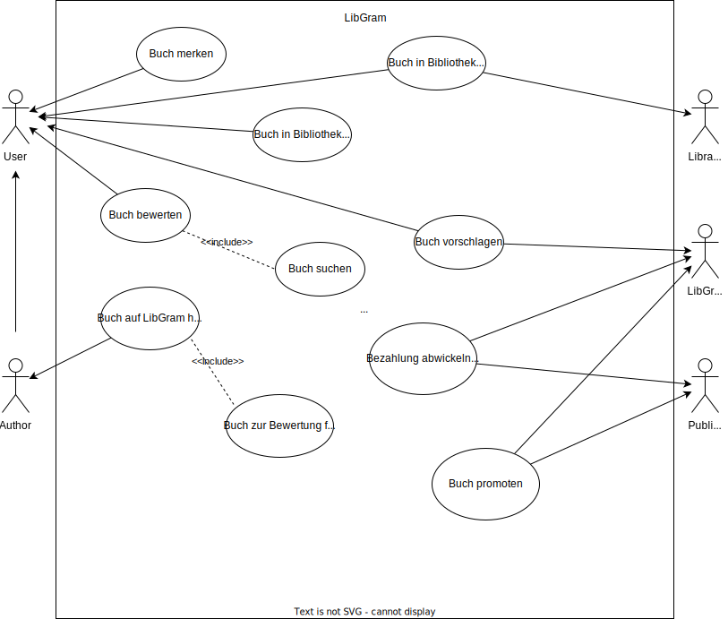

#  CREATE BOARD: LibGram

## IDEEN-BESCHREIBUNG
> LibGram ist eine Plattform für soziale Netzwerke, auf der Leser ihre Lesegewohnheiten miteinander teilen, neue Bücher entdecken und mit einer begeisterten Buchliebhabergemeinschaft in Kontakt treten können. Die Anwendung verfügt über Features wie Rezensionen von Büchern und massgeschneiderte Leseempfehlungen, die auf der individuellen Leseweise beruhen. Autoren, vor allem jene, die selbst publizieren, können ihre Werke präsentieren und von ihren Lesern direktes Feedback bekommen. Nachdem ein Buch gelesen wurde, kann es direkt weitergegeben werden. Ein nächster leser kann Freude daran haben, ohne tief ins Portemonnaie greifen zu müssen.

## ADRESSIERTE NUTZER
> LibGram richtet sich an eine Vielzahl von Nutzern:
- *Vielleser und Buchenthusiasten*, welche auf der Suche nach neuen Büchern sind ihre Erfahrungen mit anderen teilen möchten.
- *Self-Publishing-Autoren*, wleche ihre Werke Interessierten vorstellen wollen und dadurch wertvolles Feedback erhalten.
- *Umweltbewusste Leser*, welche Wert auf nachhaltiges Lesen legen und durch den Kauf von Second-Hand-Nüchern ihren ökologischen Fussabdruck minimieren möchten. 

## ADRESSIERTE BEDÜRFNISSE
> LibGram ziehlt darauf ab, verschiedene Bedürfnisse zu erfüllen:
- Neue Bücher entdecken: Leser streben danach, regelmässig neue Bücher zu entdecken, die ihren Vorlieben entsprechen, ohne sich von einer Überflutung von Inhalten überwältigen zu lassen.
- Sozialer Austausch: Viele Leser möchten ihre Ansichten und Erfahrungen mit Büchern austauschen, Gespräche führen und sich von den Ratschlägen anderer Leser leiten lassen.
- Direkter Kontakt mit Autoren: Die Leser möchten mit ihnen in Kontakt treten, Fragen stellen und Hintergrundinformationen über ihre Bücher erhalten. Die Autoren hingegen streben danach, eine intensivere Bindung zu ihren Lesern zu knüpfen.
- Kostengünstiges Lesen: Bücher sind teuer. Leser möchten nicht für jedes Buch durchschnittlich 22 Franken bezahlen und es nach 3 Tagen bereits fertiggelesen haben.

## PROBLEME
> LibGram will die folgenden Probleme adressieren:
- Überflutung von Informationen: Leser sind häufig von der Vielzahl an Buchangeboten überfordert und haben keine Ahnung, welche Bücher sie als nächstes lesen sollen.
- Ein Mangel an Personalisierung führt dazu, dass viele vorhandene Plattformen keine individuell angepassten Empfehlungen anbieten, die auf den Lesegewohnheiten eines jeden Einzelnen beruhen.

## IDEENPOTENZIAL
Mehrwert: Mückenstich vs. Hai-Attacke

🔵🔵🔵🔵⚪️⚪️⚪️⚪️⚪️⚪️

Übertragbarkeit: Robinson Crusoe vs. die Welt

🔵🔵🔵🔵🔵🔵⚪️⚪️⚪️⚪️

Machbarkeit: Hammer vs. Raumschiff

🔵🔵🔵🔵🔵🔵🔵⚪️⚪️⚪️

## DAS WOW
> LibGram hebt sich ab von der Konkurrenz ab, indem es Lesern eine personalisierte und interaktive Erfahrung während und nach des Lesens bietet. Es verbindet den Buchentdeckungsprozess, soziale Interaktionen, Autoren und natürlich Leser.

## HIGH-LEVEL-KONZEPT
> "Die soziale Buchplattform der nächsten Generation": LibGram vereint personalisierte Leseempfehlungen, eine lebendige Community von Lesern und Autoren, um Bücherentdeckungen, Interaktionen und nachhaltigen Zugang zu Literatur in einer einzigen, benutzerfreundlichen Plattform zu ermöglichen.

## WERTVERSPRECHEN
> LibGram ermöglicht es Lesern, Bücher zu entdecken, die perfekt zu ihrem Geschmack passen, während sie sich in einer interaktiven Gemeinschaft engagieren. Autoren profitieren ebenfalls von direktem Zugang zu ihren Zielgruppen, und die Plattform fördert gleichzeitig den nachhaltigen Konsum durch das Weitergeben von Büchern, die den Zugang zu Büchern erleichtert.
